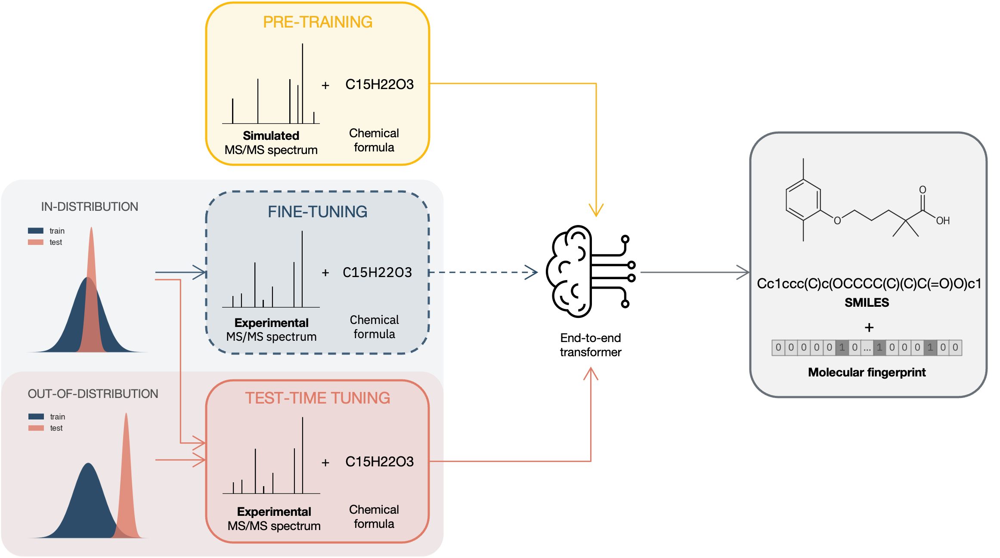

# Test-Time Tuned Language Models for MS/MS Structure Elucidation

Official implementation of "Test-Time Tuned Language Models Enable End-to-end De Novo Molecular Structure Generation from MS/MS Spectra". The framework is built on PyTorch, PyTorch Lightning and Hugging Face.

<p align='center'>
  
</p>

## Abstract
Tandem Mass Spectrometry is a cornerstone technique for identifying unknown small molecules in fields such as metabolomics, natural product discovery and environmental analysis. However, certain aspects, such as the probabilistic fragmentation process and size of the chemical space, make structure elucidation from such spectra highly challenging, particularly when there is a shift between the deployment and training conditions. Current methods rely on database matching of previously observed spectra of known molecules and multi-step pipelines that require intermediate fingerprint prediction or expensive fragment annotations. We introduce a novel end-to-end framework based on a transformer model that directly generates molecular structures from an input tandem mass spectrum and its corresponding molecular formula, thereby eliminating the need for manual annotations and intermediate steps, while leveraging transfer learning from simulated data. To further address the challenge of out-of-distribution spectra, we introduce a test-time tuning strategy that dynamically adapts the pre-trained model to novel experimental data. Our approach achieves a Top–1 accuracy of 3.16% on the MassSpecGym benchmark and 12.88% on the NPLIB1 datasets, considerably outperforming conventional fine-tuning. Baseline approaches are also surpassed by 27% and 67% respectively. Even when the exact reference structure is not recovered, the generated candidates are chemically informative, exhibiting high structural plausibility as reflected by strong Tanimoto similarity to the ground truth. Notably, we observe a relative improvement in average Tanimoto similarity of 83% on NPLIB1 and 64% on MassSpecGym compared to state-of-the-art methods. Our framework combines simplicity with adaptability, generating accurate molecular candidates that offer valuable guidance for expert interpretation of unseen spectra.

## Installation
Requires Python >= 3.10. We recommend using `uv`; installation typically takes less than two minutes.

```
git clone -b ttt-msms https://github.com/rxn4chemistry/MultimodalAnalytical.git
cd MultimodalAnalytical

pip install uv
uv venv --python 3.10.16 .venv
uv pip install -r requirements.txt   # installs this package in editable mode
uv pip install -e ".[dev]"          # optional, development tools
```

All commands below are run from the repository root. Training and evaluation use the entry points `analytical_fm.cli.training`, `analytical_fm.cli.training_ttt` (test-time tuning) and `analytical_fm.cli.predict`, configured with [Hydra](https://hydra.cc/) (configs in `configs/`).

## Data

| Dataset | Use | Source | Processing notebook | Output |
|---|---|---|---|---|
| Simulated | pre-training | [Zenodo](https://zenodo.org/records/14770232) | `paper_replication/msms/data_preparation/preprocessing-sim.ipynb` | `data/sim/` |
| MassSpecGym (MSG) | adaptation / evaluation | [Hugging Face](https://huggingface.co/datasets/roman-bushuiev/MassSpecGym) | `paper_replication/msms/data_preparation/preprocessing-msg.ipynb` | `data/MSG/` |
| NPLIB1 | adaptation / evaluation | [here](https://bio.informatik.uni-jena.de/wp-content/uploads/2020/08/svm_training_data.zip) | `paper_replication/msms/data_preparation/processing-nplib1.ipynb` | `data/NPLIB1/NPLIB1-Full/split/` |

The notebooks write to `data/` at the repository root. Each processed dataset is a parquet with the columns `formula`, `smiles`, `spectrum` (list of `[m/z, intensity]`, intensities scaled to 100) and `fingerprint` (128-bit Morgan, radius 2). MSG and NPLIB1 are stored as `train.parquet`, `val.parquet` and `test.parquet`; the NPLIB1 split files are in `paper_replication/msms/data_preparation/nplib1-full_split/`.

In the paper, the pre-training set for each benchmark excludes all molecules of that benchmark's test set (2D InChIKey matching).

## Pre-trained checkpoints

The checkpoints of the paper are available on [Hugging Face](https://huggingface.co/laura-mismetti/ttt-msms) and [Zenodo](https://zenodo.org/records/22961942) (`msg.zip`, `nplib1.zip`). Both have the same layout:

```
msg/                           nplib1/
├── preprocessor.pkl           ├── preprocessor.pkl
├── pt/pt.ckpt                 ├── pt/pt.ckpt
└── ttt-msg/ttt-msg.ckpt       └── ttt-nplib1/ttt-nplib1.ckpt
```

`pt` is pre-trained on simulated spectra (test molecules of the benchmark removed), `ttt-*` is `pt` after test-time tuning on the benchmark. Each folder also contains the `config.yaml` used for training. Always use a checkpoint with the `preprocessor.pkl` of the same folder.

Download:
```
huggingface-cli download laura-mismetti/ttt-msms --local-dir checkpoints
# or: unzip msg.zip -d checkpoints && unzip nplib1.zip -d checkpoints
```

Evaluate a checkpoint on the test set, e.g. `ttt-nplib1`:
```
python -m analytical_fm.cli.predict \
    working_dir=runs/checkpoints job_name=ttt-nplib1 \
    data_path=data/NPLIB1/NPLIB1-Full/split/ splitting=given_splits \
    data=msms/text_fingerprint model=custom_model_align \
    model.model_checkpoint_path=checkpoints/nplib1/ttt-nplib1/ttt-nplib1.ckpt \
    preprocessor_path=checkpoints/nplib1/preprocessor.pkl \
    model.guided_generation=False molecules=True
```
To run test-time tuning from a released `pt` model, use the same `model.model_checkpoint_path` and `preprocessor_path` overrides with `analytical_fm.cli.training_ttt` (see `paper_replication/msms/scripts/ttt.sh`).

## Training pipeline

The scripts are in `paper_replication/msms/scripts/`. All scripts take `-r runs/<experiment-name>` (run folder) and `-d <data path>`. Use the same `-r` for all steps of an experiment; every step writes to its own subfolder.

| Step | Command | Output |
|---|---|---|
| Pre-training | `./paper_replication/msms/scripts/pretraining.sh -r runs/<exp> -d data/sim/` | `runs/<exp>/pt/` |
| Fine-tuning (from `pt`) | `./paper_replication/msms/scripts/finetuning.sh -r runs/<exp> -d data/MSG/` | `runs/<exp>/ft/` |
| Test-time tuning (from `pt`) | `./paper_replication/msms/scripts/ttt.sh -r runs/<exp> -d data/NPLIB1/NPLIB1-Full/split/` | `runs/<exp>/ttt/` |
| From scratch (baseline) | `./paper_replication/msms/scripts/train_from_scratch.sh -r runs/<exp> -d data/MSG/` | `runs/<exp>/from-scratch/` |
| Evaluation | `./paper_replication/msms/scripts/eval.sh -r runs/<exp>/<pt\|ft\|ttt\|from-scratch> -d data/MSG/` | `runs/<exp>/<step>/eval/` |

Each step saves checkpoints in `version_0/checkpoints/`, and the predictions and Top-k metrics on the test set (`after_training-metrics_beam_*.json`). For evaluation, `-d` can be a folder with `train`/`val`/`test` parquets (only `test` is evaluated) or a single parquet file.

`ttt.sh` contains the NPLIB1 settings. For MSG, use `activeft.n_clusters=500 activeft.update_embeddings=50 model.batch_size=64`.

### Decoding options

- `model.rejection_sampling`: `formula` (default; keep only valid candidates with the target formula), `invalid` (keep only valid SMILES) or `False`.
- `model.guided_generation`: constrain beam search to the target formula. The paper results use `formula` rejection sampling without guided generation.

### Model w/o fingerprint alignment

To use the simpler model without fingerprint alignment, set:

```
model=custom_model
data=msms/text
```
