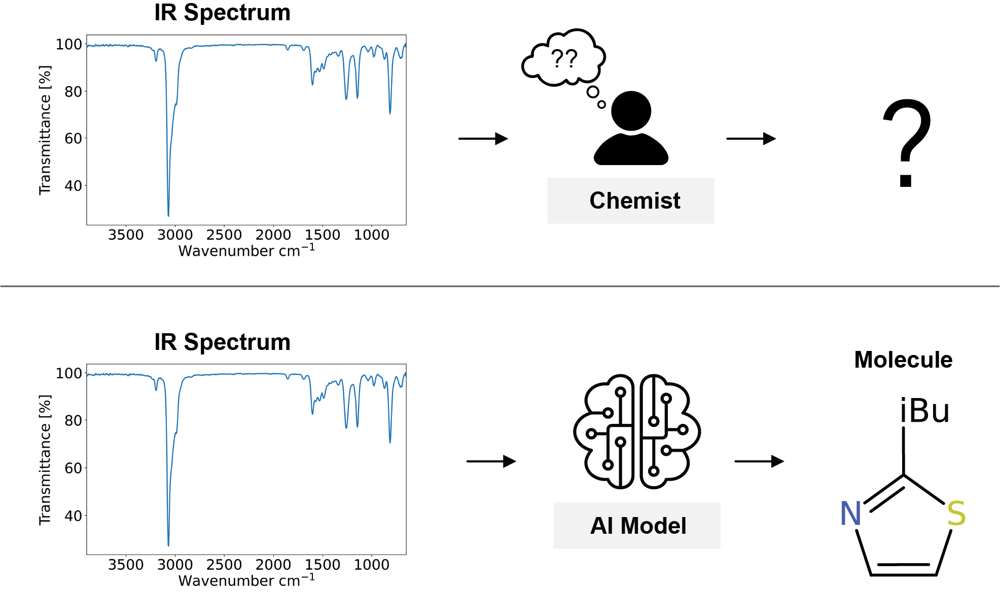

# Setting New Benchmarks in AI-driven Infrared Structure Elucidation

## Overview

The following document contains the steps to reproduce the results in [Setting New Benchmarks in AI-driven Infrared Structure Elucidation](). All scripts were tested on Linux and MacOS.

<p align='center'>
  
</p>

## Abstract

Automated structure elucidation from infrared (IR) spectra represents a significant breakthrough in analytical chemistry, having recently gained momentum through the application of Transformer-based language models. In this work, we improve our original Transformer architecture, refine spectral data representations, and implement novel augmentation and decoding strategies to significantly increase performance. We report a Top–1 accuracy of 63.79% and a Top–10 accuracy of 83.95% compared to the current performance of state-of-the-art models of 53.56% and 80.36%, respectively. Our findings not only set a new performance benchmark but also strengthen confidence in the promising future of AI-driven IR spectroscopy as a practical and powerful tool for structure elucidation. To facilitate broad adoption among chemical laboratories and domain experts, we openly share our models and code.

## Prerequisites

To reproduce the the results you need to have this repo installed and the data used to train the models downloaded and processed. Installation of the codebase can be accomplished by following the steps in the [ReadMe](../../README.md). To download the data follow the steps below. All scripts are expected to be run from the directory `analytical_models/paper_replication/ir`.


### Data Download and Processing

A total of three datasets were used for this paper: Two synthetic ones containing simulated IR spectra and one experimental one. The synthetic datasets can be obtained by downloading them either from Zendodo ([Dataset 1](https://zenodo.org/records/14770232) and [Dataset 2](https://zenodo.org/records/7928396)) or using the script below.

To download and merge the two synthetic datasets:

```
./scripts/download_process_data.sh -o data/
```

This script downloads the synthetic data and processes it into a format compatible with our models. 

The experimental data used in this paper consists of the [NIST/EPA Gas-Phase Infrared Database](https://www.nist.gov/srd/nist-standard-reference-database-35). A license for the dataset can be obtained at the link above. We have supplied a [script](scripts/filter_nist.py) to filter the molecules from the dataset to produce the same finetuning set as used in our paper.

## Replicating Table 1


## Replicating Table 2

## Replicating Table 3

## Finetuning a pretrained model