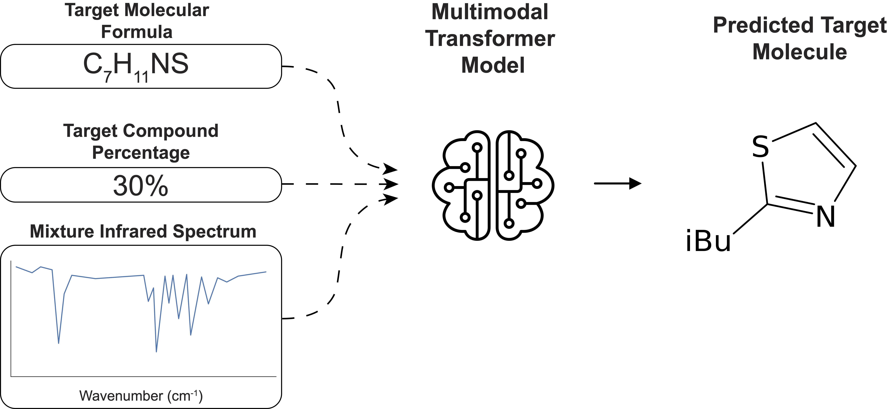

# IR Mixture paper

## Overview

The following document contains the steps to reproduce the results in [IR mixture](). All scripts were tested on Linux and MacOS. The scripts below allow the pretraining of the models in the paper on the synthetic data in addition to downloading all synthetic data used as part of the paper as well as our best pretrained model. Due licencing of the experimental dataset we can not release the finetuned models but provide functionality to easily finetune them yourself.

<p align='center'>
  
</p>

## Abstract

The application of Transformer-based language models to structure elucidation represents a breakthrough in analytical chemistry. While these advances have enabled direct molecular structure prediction from IR spectra, current methods are constrained by their requirement for the spectra of pure  compounds spectra. In this work, we address this constraint by developing a language model-driven approach that directly predicts individual molecular components from IR spectra of mixtures, expanding the practical applicability of AI-assisted spectroscopic analysis tools.
On binary balanced mixtures, our model achieves a Top-10 accuracy of up to 61.4%. Validation on 15 experimentally measured mixtures demonstrates robust transferability, maintaining a 44.0% Top-10 accuracy despite significant instrumental differences between training (gas-phase IR spectra) and test (Attenuated Reflectance spectra) data. Our models and code are openly available, facilitating adoption in chemical laboratories, with the goal to advance the analysis and interpretation of IR spectra.
## Prerequisites

To reproduce the the results you need to have this repo installed and the data used to train the models downloaded and processed. Installation of the codebase can be accomplished by following the steps in the [ReadMe](../../README.md). To download the data follow the steps below. All scripts are expected to be run from the directory `analytical_models/paper_replication/mixture`.


### Data Downloading and Processing

A total of two datasets were used for this paper: One synthetic data containing simulated IR spectra and one experimental one. The synthetic dataset can be obtained by downloading them either from Zendodo ([Dataset 1](https://zenodo.org/records/14770232)) or using the script below.

To download the synthetic dataset:

```bash
./scripts/download_process_data.sh -o data/
```

This script downloads the synthetic data and processes it into a format compatible with our models. 

The experimental data used in this paper consists of the [NIST/EPA Gas-Phase Infrared Database](https://www.nist.gov/srd/nist-standard-reference-database-35). A license for the dataset can be obtained at the link above. We have supplied a [script](scripts/filter_nist.py) to filter the molecules from the dataset to produce the same finetuning set as used in our paper.

## Replicating Table 1

Table 1 contains the script replicate the results and **pretrain** the models on the synthetic data and **fine-tune** on real data for *binary balanced mixtures*. For this use the script `replicate_table_1.sh`. See below for usage:

```
./scripts/replicate_table_1.sh -r runs/ -d data

-r: The folder in which the runs are saved
-d: The path to the training data
```

where `data` should contain the folders `pretraining` and `finetuning`.

## Replicating Table 2

Table 2 and 10 contain the ablation study on the **encoder alignment**. We evaluated the impat of 3 factors:

- reconstruction_network: *convolutional* and *mlp*.
- reconstruction_loss: *mae* and *mse*.
- lambda: *1*, *5* and *50*.

To run the ablation study use the script `replicate_table_2_and_10.sh`. See below for usage:

```bash
./scripts/replicate_table_2_and_10.sh -r runs/ -d data

-r: The folder in which the runs are saved
-d: The path to the training data
```

## Replicating Table 3

In Table 3 in the main paper we assess the improvement in performance for the *binary balanced* model when using the best configuration for the **encoder alignment**. To run the evaluation use the script `replicate_table_3.sh`. See below for usage:

```
./scripts/replicate_table_3.sh -r runs/ -d data

-r: The folder in which the runs are saved
-d: The path to the training data
```

This script finetunes the best aligned model on real data.


## Replicating Table 4 and 5

In Table 4 and 5 in the main paper we assess the performance of our model when pretrained (and finetuned) for the *binary imbalance* task. Table 4 shows the result for the baseline model (without alignment) while Table 5 shows the results for the models with the best alignment configuration. To run the evaluation use the scripts `replicate_table_4.sh` and `replicate_table_5.sh`. See below for usage:

```
./scripts/replicate_table_4.sh -r runs/ -d data
./scripts/replicate_table_5.sh -r runs/ -d data

-r: The folder in which the runs are saved
-d: The path to the training data
```

## Replicating Table 6

In Table 6 in the main paper we assess the performance in multitask setting when using the best configuration for the **encoder alignment**.
The multitask model is trained with different imbalances config with the following compound presence in the mixture: 10%, 30%, 40%, 50%, 60%, 70% and 90%. To run the evaluation use the script `replicate_table_6.sh`. See below for usage:

```
./scripts/replicate_table_6.sh -r runs/ -d data

-r: The folder in which the runs are saved
-d: The path to the training data
```

## Replicating Table 7

Table 6 contains the script replicate the results and **pretrain** the models on the synthetic data and **fine-tune** on real data for *ternary balanced mixtures*. For this use the script `replicate_table_7.sh`. See below for usage:

```
./scripts/replicate_table_7.sh -r runs/ -d data

-r: The folder in which the runs are saved
-d: The path to the training data
```


## Replicating Table 8

Table 8 shows our multitask model capability, when using the best configuration for the **encoder alignment**, on predicting components from *real mixtures*. The evaluation is done with and without sample rejection, i.e. rejecting samples at evaluation time when the prediction does not match with the target chemical formula. To run the evaluation use the script `replicate_table_8.sh`. See below for usage:

```
./scripts/replicate_table_8.sh -r runs/ -d data

-r: The folder in which the runs are saved
-d: The path to the training data
```

where `data` should contain the folder `real_mixtures`.

