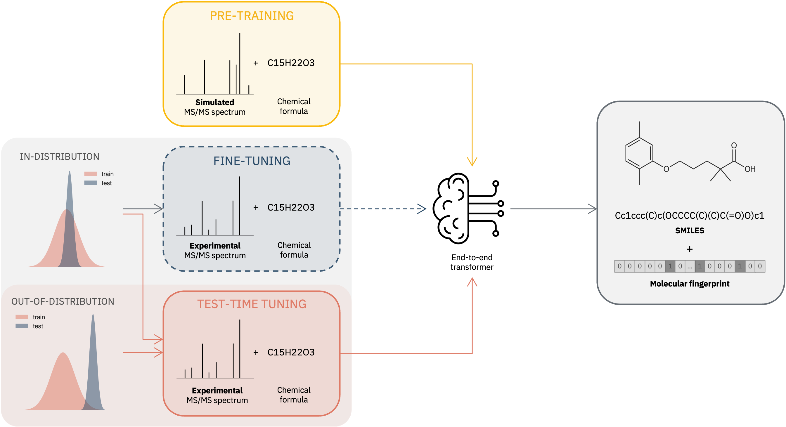

# Structure elucidation from MS/MS spectra

This document contains the steps to reproduce the results in the paper [Test-Time Tuned Language Models Enable End-to-end De Novo Molecular Structure Generation from MS/MS Spectra](https://arxiv.org/abs/2510.23746).

<p align='center'>
  
</p>


## Abstract
Tandem Mass Spectrometry is a cornerstone technique for identifying unknown small molecules in fields such as metabolomics, natural product discovery and environmental analysis. However, certain aspects, such as the probabilistic fragmentation process and size of the chemical space, make structure elucidation from such spectra highly challenging, particularly when there is a shift between the deployment and training conditions. Current methods rely on database matching of previously observed spectra of known molecules and multi-step pipelines that require intermediate fingerprint prediction or expensive fragment annotations. We introduce a novel end-to-end framework based on a transformer model that directly generates molecular structures from an input tandem mass spectrum and its corresponding molecular formula, thereby eliminating the need for manual annotations and intermediate steps, while leveraging transfer learning from simulated data. To further address the challenge of out-of-distribution spectra, we introduce a test-time tuning strategy that dynamically adapts the pre-trained model to novel experimental data. Our approach achieves a Top–1 accuracy of 3.16% on the MassSpecGym benchmark and 12.88% on the NPLIB1 datasets, considerably outperforming conventional fine-tuning. Baseline approaches are also surpassed by 27% and 67% respectively. Even when the exact reference structure is not recovered, the generated candidates are chemically informative, exhibiting high structural plausibility as reflected by strong Tanimoto similarity to the ground truth. Notably, we observe a relative improvement in average Tanimoto similarity of 83% on NPLIB1 and 64% on MassSpecGym compared to state-of-the-art methods. Our framework combines simplicity with adaptability, generating accurate molecular candidates that offer valuable guidance for expert interpretation of unseen spectra.


## Prerequisites

To reproduce the results you need to install this repo and download and process the data used to train and evaluate the models. Installation of the codebase can be done by following the steps in the [ReadMe](../../README.md). To download the data, train and evaluate the models follow the steps below. 

## Data Download and Processing

We use three datasets to train the models: 
- Simulated dataset, to pre-train the model, available on [Zenodo](https://zenodo.org/records/14770232)
- MassSpecGym (here often referred to as MSG), for adaptation, availabe [here](https://huggingface.co/datasets/roman-bushuiev/MassSpecGym)
- NPLIB1, for adaptation, can be downloaded from [here](https://bio.informatik.uni-jena.de/wp-content/uploads/2020/08/svm_training_data.zip) and processed using the notebook `MultimodalAnalytical/paper_replication/msms/data_preparation/preparation-nplib1.ipynb`

We suggest to create a folder `data/` to store all the datasets.

## Training the models
All scripts are expected to be run from the directory `paper_replication/msms`. So, after downloading and installing the repo, change directory as shown below.

```
cd paper_replication/msms
```

### From scratch
Train a model from randomly initialized weights on experimental data. You can separately train the models on MassSpecGym dataset or NPLIB1 by running the following commands.
```
./scripts/train_from_scratch.sh -r runs/<experiment-name> -d data/MSG/
./scripts/train_from_scratch.sh -r runs/<experiment-name> -d data/NPLIB1/

-r: The folder in which the runs are saved
-d: The path to the training data
```

### Pre-training
The pre-trainig is performed on the simulated data.
```
./scripts/pretraining.sh -r runs/<experiment-name> -d data/sim/

-r: The folder in which the runs are saved
-d: The path to the training data
```

### Fine-tuning
To finetune a pretrained model, you first have to run the pretraining step and then substitute below `<experiment-name>` with the name you used for the pre-training run. 
If you want to train a different model, you can also change the path to model checkpoint and preprocessor in `scripts/finetuning.sh`.
```
./scripts/finetuning.sh -r runs/<experiment-name> -d data/MSG/
./scripts/finetuning.sh -r runs/<experiment-name> -d data/NPLIB1/

-r: The folder in which the runs are saved
-d: The path to the training data
```

### Test-time tuning
The settings in `scripts/tt.sh` are the ones to reproduce the results on NPLIB1. If you want to reproduce the results on MassSpecGym you have to modify the values according to the ones reported in the appendix of the paper.
```
./scripts/ttt.sh -r runs/<experiment-name> -d data/NPLIB1/

-r: The folder in which the runs are saved
-d: The path to the training data
```

### Evaluation
You can either specify the path to the parquet file containing the data to be evaluated or the path to a folder. In the last case, the code will expect the folder to contain train, validation and test parquets, and will perform the evaluation only on the test parquet `test.parquet`.
We suggest to save the evaluation inside the folder containing the run (and model) that you want to evaluate.

```
./scripts/eval.sh -r runs/<path-to-previous-run>/eval -d data/MSG/test.parquet
./scripts/eval.sh -r runs/<path-to-previous-run>/eval -d data/NPLIB1/

-r: The folder in which the runs are saved
-d: The path to the data to be evaluated 
```

### Model w/o fingerprint alignment

The given scripts already use the model with fingerprint alignment, however, it is possible to use the simpler model without fingerprint alignment by changing the following fields in the configuration as below.

```
model=custom_model
data=msms/text
```
