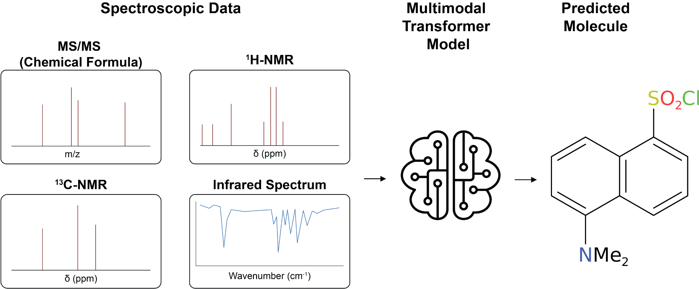

# Automated Structure Elucidation at Human-Level Accuracy via a Multimodal Multitask Language Model

## Overview

The following document contains the steps to reproduce the results in [Automated Structure Elucidation at Human-Level Accuracy via a Multimodal Multitask Language Model](https://chemrxiv.org/engage/chemrxiv/article-details/67eaab5c6dde43c908da98cd). All scripts were tested on Linux and MacOS. The scripts below allow the pretraining of the models in the paper on the synthetic data in addition to downloading all synthetic data used as part of the paper as well as our best pretrained model.

<p align='center'>
  
</p>

## Abstract

Structure elucidation is crucial for identifying unknown chemical compounds, yet traditional spectroscopic analysis remains labour-intensive and challenging, particularly when applied to a large number of spectra. Although machine learning models have successfully predicted chemical structures from individual spectroscopic modalities, they typically fail to integrate multiple modalities concurrently, as expert chemists usually do. Here, we introduce a multimodal multitask transformer model capable of accurately predicting molecular structures from integrated spectroscopic data, including Nuclear Magnetic Resonance (NMR) and Infrared (IR) spectroscopy. Trained initially on extensive simulated datasets and subsequently finetuned on experimental spectra, our model achieves Top-1 prediction accuracies up to 96%. We demonstrate the model's capability to leverage synergistic information from different spectroscopic techniques and show that it performs on par with expert human chemists, significantly outperforming traditional computational methods. Our model represents a major advancement toward fully automated chemical analysis, offering substantial improvements in efficiency and accuracy for chemical research and discovery.

## Prerequisites

To reproduce the the results you need to have this repo installed and the data used to train the models downloaded and processed. Installation of the codebase can be accomplished by following the steps in the [ReadMe](../../README.md). To download the data follow the steps below. All scripts are expected to be run from the directory `analytical_models/paper_replication/multimodal`.


### Data Downloading and Processing

We pretrain our models on synthetic data containing simulated 1H, 13C and IR spectra and subsequently finetune the models on experimental data. The synthetic dataset can be obtained by downloading them either from Zendodo ([Dataset 1](https://zenodo.org/records/14770232)) or using the script below.

To download the synthetic dataset:

```bash
./scripts/download_process_data.sh -o data/
```

This script downloads the synthetic data. 

The experimental data used in this paper consists of the [Chemical Education Dataset](https://pubs.acs.org/doi/10.1021/acs.jchemed.3c00046). 

## Replicating Table 1

Table 1 contains the performance of singletask models trained to predict the chemical structure from IR, 13C-NMR, 1H-NMR, and all three combined as well as a multitasking model trained to accomplish all four tasks. A pretrained checkpoint for the multitasking model is provided on [Zenodo]().

To pretrain the singletask models run the following script:
```
./scripts/singletask_models.sh -r runs/ -d data/pretrain_data/multimodal_spectroscopic_dataset

-r: The folder in which the runs are saved
-d: The path to the training data
```

To pretrain the multitasking model run the following script:
```
./scripts/multitask_model.sh -r runs/ -d data/pretrain_data/multimodal_spectroscopic_dataset

-r: The folder in which the runs are saved
-d: The path to the training data
```

## Finetuning

To finetune the pretrained multitask model use the following script. Note a seperate finetuning dataset containing experimental data is required. The script is expected to be run after a multitasking model has been pretrained.
```
./scripts/multitask_model.sh -r runs/multitasking -d data/experimental

-r: The folder in which the runs are saved
-d: The path to the training data
```

