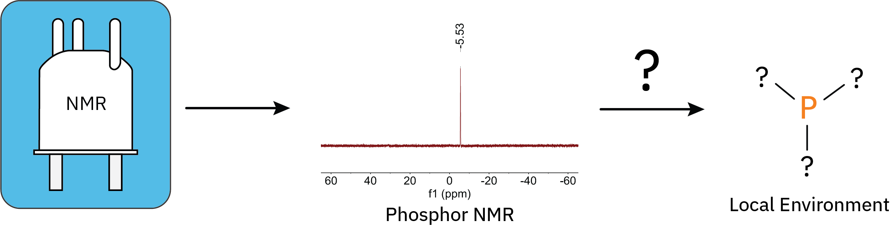

# From Spectra to Structure: AI-Powered <sup>31</sup>P-NMR Interpretation

This document contains the steps to reproduce the results in the paper [From Spectra to Structure: AI-Powered <sup>31</sup>P-NMR Interpretation](). All scripts were tested on Linux and MacOS.

<p align='center'>
  
</p>


## Abstract

Phosphorus-31 Nuclear Magnetic Resonance (<sup>31</sup>P-NMR) spectroscopy is a powerful technique for characterizing phosphorus-containing compounds in diverse chemical environments. However, spectral interpretation remains a time-consuming and expertise-dependent task, relying on reference tables and empirical comparisons. In this study, we introduce a data-driven approach that automates <sup>31</sup>P-NMR spectral analysis, providing rapid and accurate predictions of local phosphorus environments. By leveraging a curated dataset of experimental and synthetic spectra, our model achieves a Top–1 accuracy of 55.55% and a Top-5 accuracy of 80.84% at predicting the local environment around a phosphorous atom. Furthermore, it demonstrates robustness across different solvent conditions and outperforms expert chemists by 25% in spectral assignment tasks. The models, datasets, and architecture are openly available, facilitating seamless adoption in chemical laboratories engaged in structure elucidation, with the goal of advancing <sup>31</sup>P-NMR spectral analysis and interpretation.

## Prerequisites

To reproduce the the results you need to have this repo installed and the data used to train the models downloaded and processed. Installation of the codebase can be accomplished by following the steps in the [ReadMe](../../README.md). To download the data follow the steps below. All scripts are expected to be run from the directory `analytical_models/paper_replication/phosphor`.

### Data Download and Processing

We use two datasets to train the models: One pretraining dataset of synthetic <sup>31</sup>P-NMR spectra which we generated ourselves and the dataset by Hack et al. The synthetic dataset is available on [Zenodo](link_here) and the one by Hack et al. is availabe [here](https://github.com/clacor/Ilm-NMR-P31) (last accessed 25.02.2025).

To download and process the two datasets execute the following script:

```
./scripts/download_process_data.sh -o data/
```

This script downloads the experimental as well as the synthetic data and processes the experimental data into a format compatible with our models. At the same time the experimental data is filtered to remove molecules with more than 35 and less than 5 heavy atoms and duplicates are removed. The data is saved to the specified folder, in this case `data/`.

## Replicating Table 2

Table 2 in the main paper contains ablations on training our models from scratch on the data by Hack et al. We provide a script that allows the replication of our results. The scripts performs 5-fold cross validation across 6 experiments. Each training takes around 12 minutes on a V100 GPU. The result for each training are saved in the folder for the individual run in the file `test_data_beam_10.pkl`.

```
./scripts/phosphor_from_scratch.sh -r runs/from_scratch -d data/hack_clean/

-r: The folder in which the runs are saved
-d: The path to the training data
```

## Replicating Table 3

Table 3 contains results on models that have been pretrained first on the synthetic and subsequently finetuned on the experimental data. The following two scripts allow reproduction of the results by first pretraining the models and then finetuning them. Pretraining a models takes around 2.5h on a V100 GPU. In total the scripts pretrains 6 models and finetunes each with 5-fold cross validation on the experimental data.

### Pretraining

```
./scripts/phosphor_pretraining.sh -r runs/pretraining -d data/pretraining/

-r: The folder in which the runs are saved
-d: The path to the training data
```

### Finetuning

```
./scripts/phosphor_finetuning.sh -r runs/pretraining -d data/hack_clean/

-r: The folder in which the runs are saved
-d: The path to the training data
```