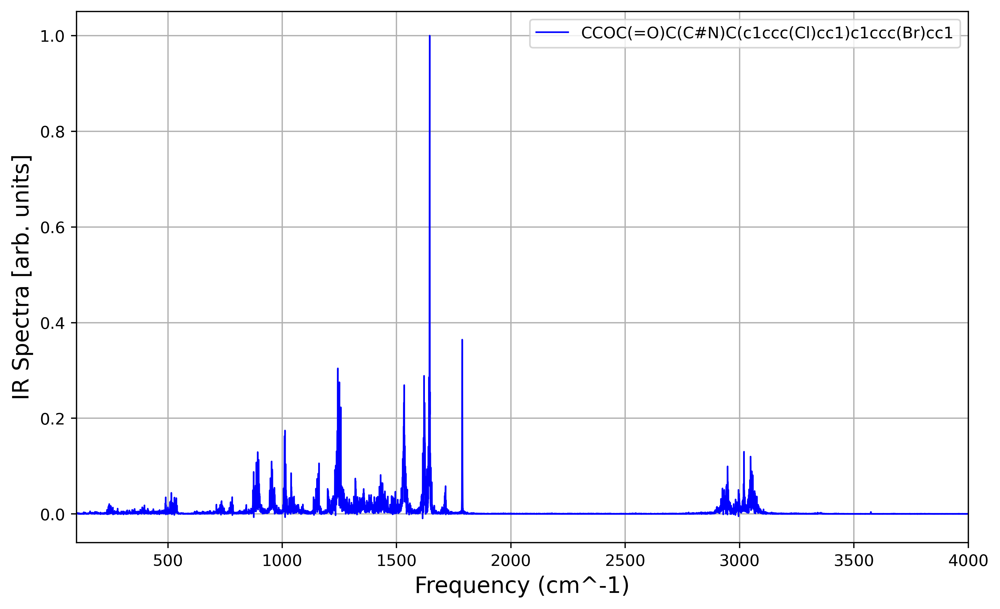
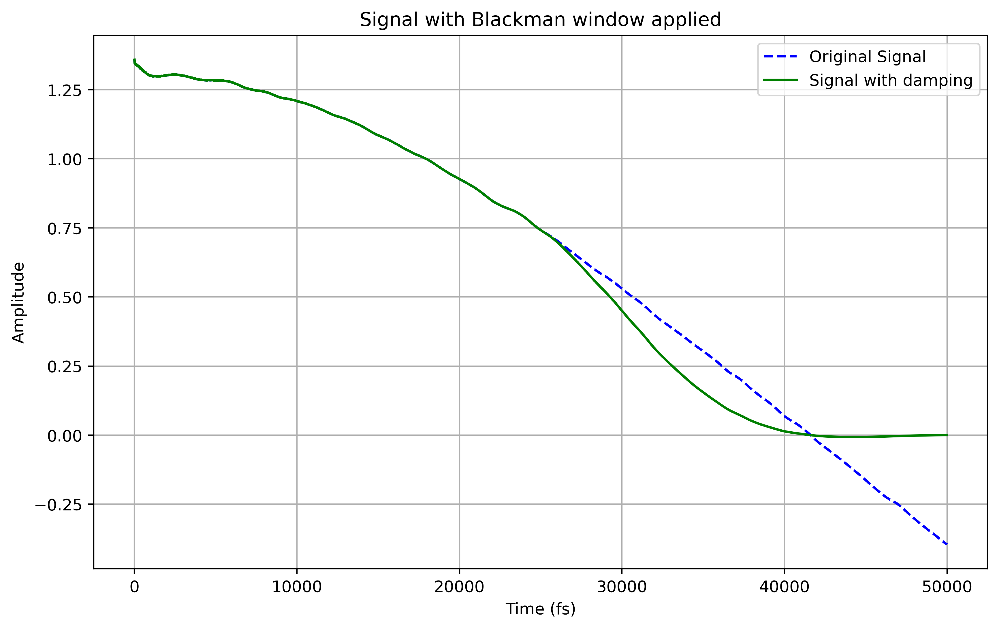

# ai4spectra-compute-spectra

Tools to perform first-principle simulations for NMR & IR spectra, along with Python scripts designed to process and visualize infrared (IR) and nuclear magnetic resonance (NMR) spectral data.

## Overview

This repository contains the necessary scripts and documentation to reproduce the results presented in the paper:

[**IR–NMR Multimodal Computational Spectra Dataset for 177K Patent-Extracted Organic Molecules**](https://chemrxiv.org/engage/chemrxiv/article-details/684f1f86c1cb1ecda0230ceb)

The full dataset, an integral part of this work, is publicly available on Zenodo under the Community Data License Agreement Permissive 2.0:
[https://doi.org/10.5281/zenodo.15669242](https://doi.org/10.5281/zenodo.15669242)

---

## 1. IR Spectra Processing

This section covers scripts related to processing and visualizing Infrared (IR) spectra.

### 1.1 Plot IR Spectra from Parquet Files

This script reads IR spectrum data stored in Parquet format and generates a `.png` plot for a selected record.

* **Script:** `scripts_ir_spectra/make_IR_plot_from_parquet.py`
* **Customization:** To change the molecule, edit the record index directly within the script. You will also need to adjust the path to your Parquet files. The script supports processing single or multiple Parquet files.

**Example Output:**
<p align="center">
  
</p>

* **Script:** `scripts_ir_spectra/plot_IR_spectra_from_parquet.ipynb` allows for direct visualization.

#### Dependencies

Required Python packages:

* `matplotlib`
* `numpy`
* `pandas`
* `pyarrow`

You can install them using pip:

```bash
pip install matplotlib numpy pandas pyarrow
````

### 1.2 Compute IR Spectra from Dipole–Dipole Autocorrelation

This script computes IR spectra from Molecular Dynamics (MD) trajectory data, specifically from NumPy dipole arrays, using dipole–dipole autocorrelation and Fourier transform.

  * **Script:** `scripts_ir_spectra/compute_ir_spectra_from_dipole_dipole_autocorrelation.py`

**Example Output:**
See files in 
`sample_data/autocorr_orig_dipole_id_0.txt`: original dipole-dipole autocorrelation
`sample_data/autocorr_damp_dipole_id_0.txt`: damped dipole-dipole autocorrelation
`sample_data/IR-data_dipole_id_0_auto_damped.csv`: csv file with the spectra

<p align="center">
  
</p>


#### Usage

```bash
python scripts_ir_spectra/compute_ir_spectra_from_dipole_dipole_autocorrelation.py <dipole.npy> <md_timestep_in_fs>
```

  * `<dipole.npy>`: Path to a NumPy `.npy` file containing dipole vectors of shape `(n_steps, 3)`.
  * `<md_timestep_in_fs>`: MD simulation timestep in femtoseconds (fs).

The script will output the autocorrelation data as `.txt` and a `.png` plot, and the IR spectrum as a `.csv` file in the same directory.

-----

## 2\. Preprocessing Scripts for First-Principle Simulations

This section introduces utility scripts located in the `scripts/` folder, which are useful for preparing input files for first-principle simulations (e.g., CPMD). Refer to `examples/example1` and `examples/example2` for practical demonstrations.

### 2.1 Generate XYZ Files from SMILES Strings

This script converts SMILES strings into `.xyz` coordinate files.

  * **Script:** `scripts/make_xyz_file_from_smiles.py`

#### Usage

Run the script by providing a text file containing SMILES strings:

```bash
python scripts/make_xyz_file_from_smiles.py --smiles smiles.txt
```

**Example `smiles.txt` content:**

```
Brc1ccccc1
C/C=C/C=O
```

**Output Example:**

```
number of smiles: 2
uniq number of smiles: 2
0 smiles: Brc1ccccc1  has charge: 0
1 smiles: C/C=C/C=O  has charge: 0
```

This will generate `conf_0.xyz`, `conf_1.xyz`, and so on, for each SMILES string.

### 2.2 Generate CPMD Input Files from XYZ

These scripts create input files for CPMD (Car-Parrinello Molecular Dynamics) from `.xyz` coordinate files. This includes options for geometry optimization (`geop`), NMR calculations with Linear Response (LR), or a combined workflow.

  * **Script 1 (Standard):** `scripts/make_input_cpmd_from_xyz.py`
  * **Script 2 (with vdW):** `scripts/make_input_cpmd_with_vdW_from_xyz.py` (for inputs including van der Waals corrections)

#### Usage

To see all available options for `make_input_cpmd_from_xyz.py`, run:

```bash
python scripts/make_input_cpmd_from_xyz.py --help
```

**Available Options:**

```
usage: make_input_cpmd_from_xyz.py [-h] [--filexyz FILEXYZ] [--do_geop DO_GEOP] [--do_nmr DO_NMR] [--do_both DO_BOTH]

optional arguments:
  -h, --help            show this help message and exit
  --filexyz FILEXYZ     name of the input xyz file
  --do_geop DO_GEOP     str: `yes` or `no`; set this flag to write cpmd input file for geometry optimization
  --do_nmr DO_NMR       str: `yes` or `no`; set this flag to write cpmd input file for NMR with Linear Response (LR)
  --do_both DO_BOTH     str: `yes` or `no`; set this flag to run geometry optimization and NMR sequentially;
                        the NMR input will enable RESTART from LATEST, which requires a prior geometry optimization output.
```

**Example:**
To create input files using GTH Pseudopotentials for CPMD from an XYZ file:

```bash
python scripts/make_input_cpmd_from_xyz.py --filexyz conf_99999.xyz --do_geop yes
```

-----

## License

This project is licensed under the MIT License. 

