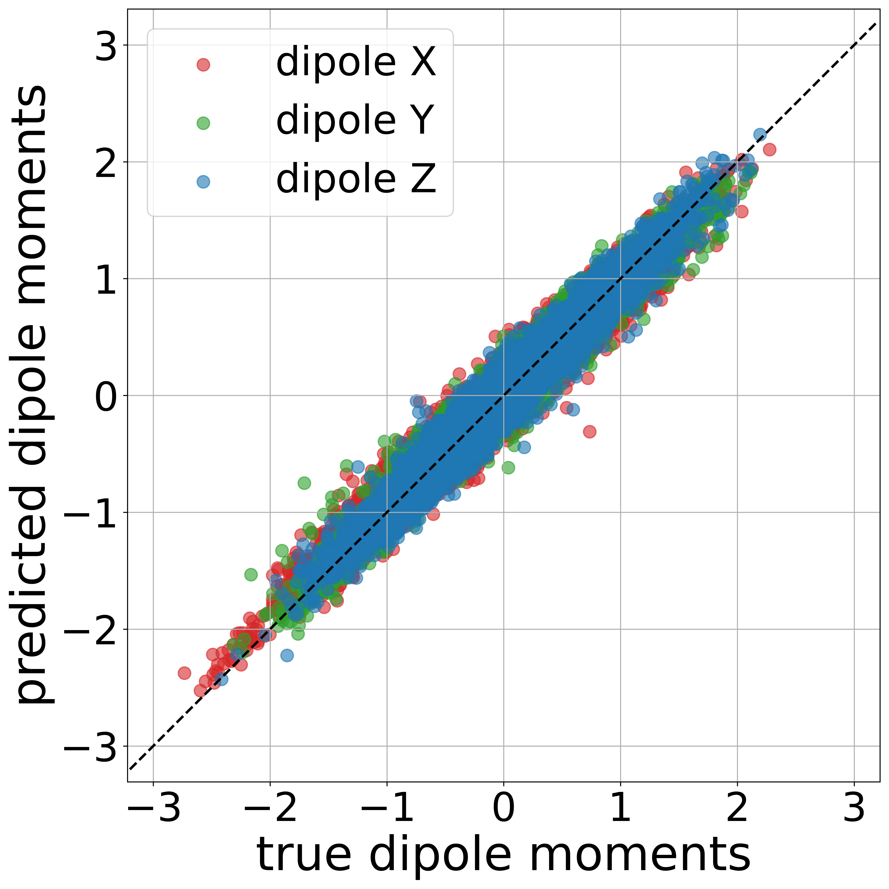

Sure! Here's your corrected and Markdown-formatted version, preserving your structure and information:

````markdown
# Comparison of Predicted and Ground Truth Dipole Moments for Unseen Data

The following document contains the steps to reproduce the results in Figure 6 and Figure 7 of [IR–NMR Multimodal Computational Spectra Dataset for 177K Patent-Extracted Organic Molecules](https://chemrxiv.org/engage/chemrxiv/article-details/684f1f86c1cb1ecda0230ceb).  
The full dataset is publicly available on Zenodo under the Community Data License Agreement Permissive 2.0 at [https://doi.org/10.5281/zenodo.15669241](https://doi.org/10.5281/zenodo.15669241).

## Description

In the Zenodo dataset [https://doi.org/10.5281/zenodo.15669241](https://doi.org/10.5281/zenodo.15669241), there is one file: `ERROR_PRED_TRUE_DIPOLE.zip`.
Once unpacked, it contains two folders `DC4` and `DD6`.  
These folders contain the predicted and ground truth dipole moments for unseen data.  
- `DC4` contains unseen frames of molecules present in the training set.  
- `DD6` contains frames of molecules never seen during training.

Figure 7 ([link](https://chemrxiv.org/engage/chemrxiv/article-details/684f1f86c1cb1ecda0230ceb)) shows that the molecules with IDs `22447` and `11726` are solely responsible for the deviation observed in Figure 6. The structure of these two molecules is also illustrated.

Download the `DC4` and `DD6` folders and run the following scripts.

The lists contain the IDs of the molecules:
- `list_DC4.txt` (800 molecules) 
- `list_DD6.txt` (843 molecules)
- `list_DD6_test_selected.txt` (841 molecules, same as `list_DD6.txt` but excludes the two outliers with IDs `22447` and `11726`)

## Scripts

After running `collect_y_pred_y_true.py`, you can run `plot_figure6.py` to generate Figure 6.
This will generate the following files:
`y_pred_unseen_frames.npy`
`y_pred_unseen_molecules.npy`
`y_true_unseen_frames.npy`
`y_true_unseen_molecules.npy`


```bash
plot_figure6.py
````

<p align="center">
  
</p>

To generate Figure 7 (from folder `DD6` using `list_DD6_test_selected.txt`, which excludes the two outliers), run:

```bash
collect_y_pred_y_true_Only_plot_selected.py
```

This will generate the following files:
`y_pred_unseen_molecules_selected.npy`
`y_true_unseen_molecules_selected.npy`

Then run:

```bash
plot_figure7.py
```

<p align="center">
  
</p>
```

