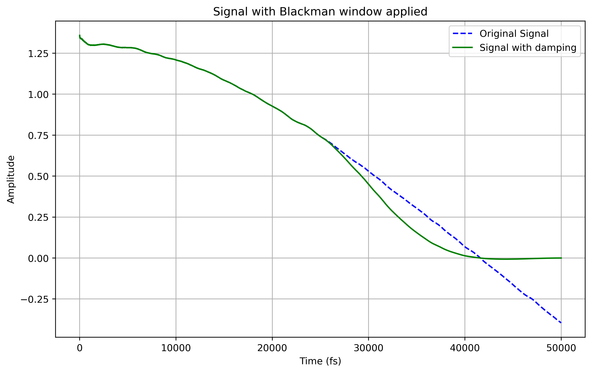

# IR spectra

## 1. IR Spectra Processing

This section covers scripts related to processing and visualizing Infrared (IR) spectra.

### 1.1 Plot IR Spectra from Parquet Files

This script reads IR spectrum data stored in Parquet format and generates a `.png` plot for a selected record.

* **Script:** `scripts_ir_spectra/make_IR_plot_from_parquet.py`
* **Customization:** To change the molecule, edit the record index directly within the script. You will also need to adjust the path to your Parquet files. The script supports processing single or multiple Parquet files.

**Example Output:**
<p align="center">
  
</p>

* **Script:** `scripts_ir_spectra/plot_IR_spectra_from_parquet.ipynb` allows for direct visualization.

### 1.2 Compute IR Spectra from Dipole–Dipole Autocorrelation

This script computes IR spectra from Molecular Dynamics (MD) trajectory data, specifically from NumPy dipole arrays, using dipole–dipole autocorrelation and Fourier transform.
This script has been adapted from Efrem Braun https://github.com/EfremBraun/calc-ir-spectra-from-lammps, doi.org/10.5281/zenodo.154672.

* **Script:** `scripts_ir_spectra/compute_ir_spectra_from_dipole_dipole_autocorrelation.py`

**Example Output:**
See files in 
`sample_data/autocorr_orig_dipole_id_0.txt`: original dipole-dipole autocorrelation
`sample_data/autocorr_damp_dipole_id_0.txt`: damped dipole-dipole autocorrelation
`sample_data/IR-data_dipole_id_0_auto_damped.csv`: csv file with the spectra

<p align="center">
  
</p>


#### Usage

```bash
python scripts_ir_spectra/compute_ir_spectra_from_dipole_dipole_autocorrelation.py <dipole.npy> <md_timestep_in_fs>
```

  * `<dipole.npy>`: Path to a NumPy `.npy` file containing dipole vectors of shape `(n_steps, 3)`.
  * `<md_timestep_in_fs>`: MD simulation timestep in femtoseconds (fs).

The script will output the autocorrelation data as `.txt` and a `.png` plot, and the IR spectrum as a `.csv` file in the same directory.

